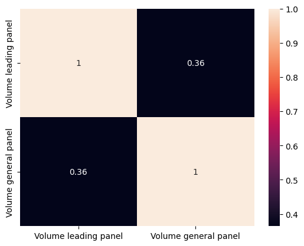
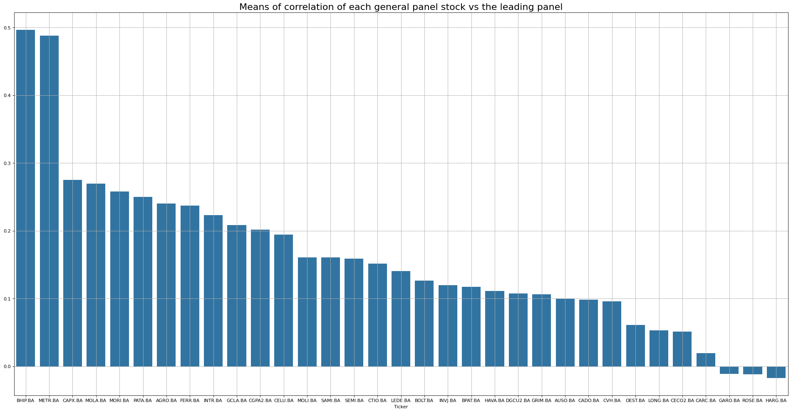
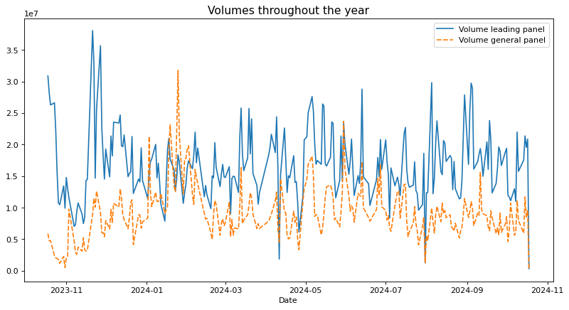
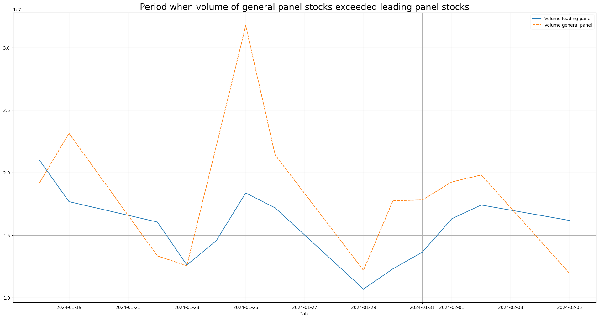
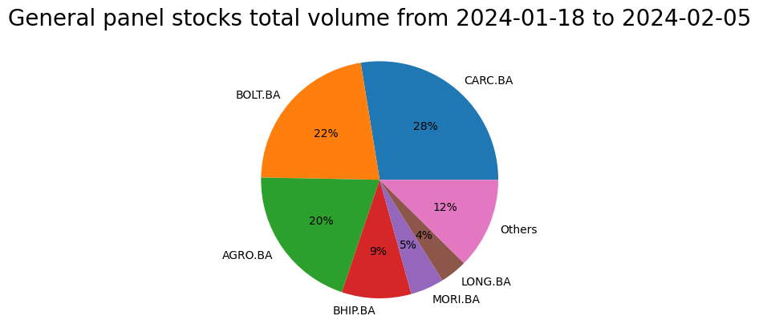
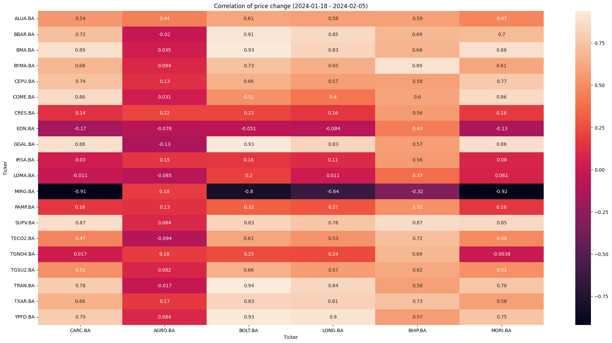
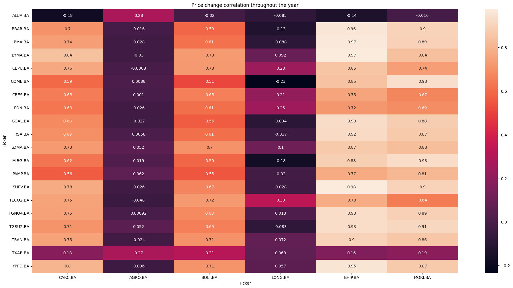

# EDA_BYMA_Volume_Market

The goal of this study is to explore BYMA´s volume in one year. We´ll get some ideas of what happened throught the year and which stock were the most prominents.
We do not stop to study each particular stock, in this case we preceed to view BYMA´s volume globally, preparing to begin exploring a particular stock or group of stocks.

# Insights summary 

The most important findings from this exploration involve the volume correlation between two groups of stocks: “Leading Panel” and “General Panels,” where the most prominent stocks
are in the leading panel.

♦ Firstly we can find that the total volume per day of both panels has a correlation of 0.36 throughout the year

Correlation of the volume of each stock in the general panel with the total volume of the leading panel:

♦ An important period occurring between 2024-01-18 and 2024-02-05 is when the overall panel volume increases above that of the leading panel:

 This excess on volume were mainly due to CARC , AGRO, BOLT, LONG. BHIP , MORI:

 

 

 ♦ Two stocks could have the same volume but their price could go in oposit directions and this could be a clue of capital flow from one group of stocks to another, but this was not the case.

 We can see the price change correlation between 2024-01-18 and 2024-02-05: 

 

Compared with the correlation matrix of price change over the year, we can see that some stocks like LONG.BA had a change of direction in the period 2024-01-18 - 2024-02-05

 

 ## Resume 

 <li>Volumes in general have a neutral to positive correlation</li>
<li>Price changes generally have a neutral to positive correlation</li>
<li>There was a period from 2024-01-18 to 2024-02-05 were volume of stocks on general panel exceeded the leading panel</li>
<li>The increase in volume at 2024-01-18 to 2024-02-05 of general panel stocks, were mainly due to CARC , AGRO, BOLT, LONG. BHIP , MORI</li>
<li>AGRO at 2024-01-18 to 2024-02-05 had a neutral to positve correlation with the leading panel unlike to the negative correlation throughou the year</li>
<li>The higest pike at 2024-01-25 in change of volume and price were followed by a profit-taking</li>
<li>Given the correlation of price changes in general there is no evidence of capital flow from one group to another</li>
<li>Correlation Matrices shows interesting relationships between groups of stock for further study</li>
</ul>

 

 

